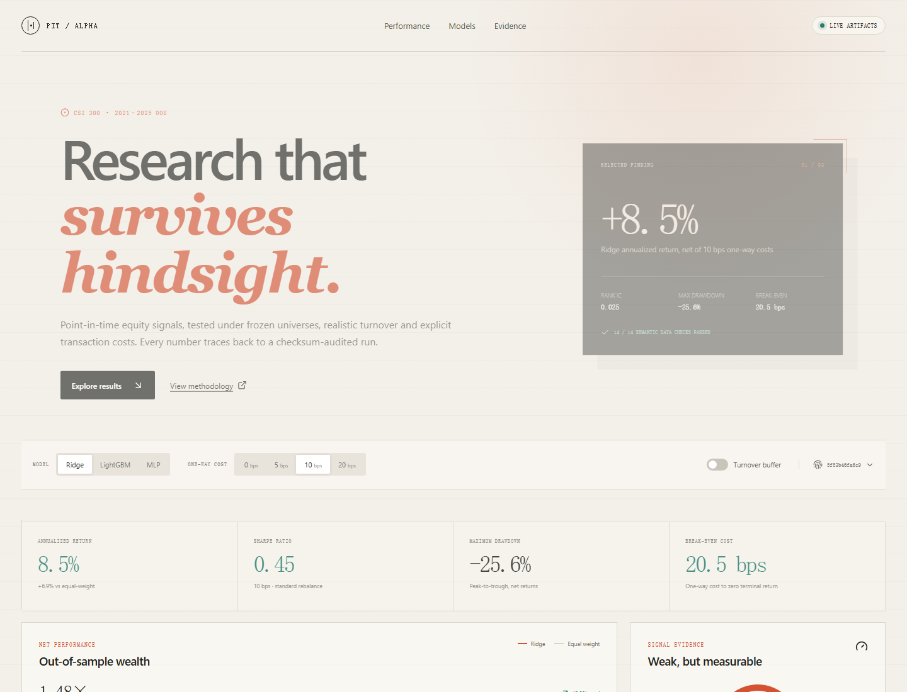

# PIT Alpha Lab

[](https://github.com/TheRyans520/pit-alpha-lab/actions/workflows/ci.yml)
[](https://www.python.org/)
[](LICENSE)

An auditable, point-in-time quantitative equity research platform that connects model scores to
portfolio decisions, transaction costs, uncertainty and reproducible evidence.

**Research engine · read-only API · React dashboard · frozen experiment lineage**



## Why it is different

Many public quant projects end with a notebook and a gross backtest. PIT Alpha Lab is built around
the parts that usually invalidate those results:

- historical index membership is evaluated on each decision date;
- labels, embargoes, preprocessing and execution timing are explicit and tested;
- scores become actual holdings with turnover and one-way costs;
- every result is linked to a resolved config, snapshot and content-hashed artifacts;
- uncertainty, drawdown and negative model results remain visible.

The project is designed as an interview-ready QR/QD portfolio project and a reusable research
foundation. It is not an offer to trade or evidence of live execution performance.

It now has two explicit product tracks:

1. **Trustworthy model evaluation:** plug in a built-in or reviewed external model, then test it
   through the same PIT splits, hard market constraints, costs, risk metrics and artifacts.
2. **Built-in reference alpha:** use the project's own literature-reviewed temporal model as a
   transparent baseline, with every borrowed idea, ablation and failed result recorded.

## Headline case study

The frozen CSI300 study uses annual walk-forward refits over 2021–2025, a weekly equal-weight Top-30
portfolio and 10 bps one-way transaction costs.

| Model | IC | Rank IC | Net annualized return | Sharpe | Maximum drawdown | Decision |
|---|---:|---:|---:|---:|---:|---|
| Ridge | 0.0278 | 0.0253 | **8.49%** | **0.445** | -25.61% | Preferred baseline |
| LightGBM | 0.0241 | 0.0248 | 5.36% | 0.323 | -43.73% | Retained comparison |
| MLP | 0.0070 | 0.0075 | -11.33% | -0.363 | -60.55% | Rejected |

Ridge beat the eligible-universe equal-weight benchmark by 6.9 percentage points annualized after
costs. A five-seed market-context network also failed the promotion gate: all five unbuffered runs
lost money after 10 bps despite positive average Rank IC. This is an important finding—not a result
to hide. Signal quality did not automatically survive portfolio construction and turnover.

These are historical L1 public-data results. The source does not provide institutional-grade
security-master or execution guarantees, and the 2021–2025 period is now considered observed. The
next model comparison must use a fresh holdout or a new market.

## System design

```mermaid
flowchart LR
    A["Frozen market snapshot"] --> B["Point-in-time panel"]
    B --> C["14 semantic data checks"]
    C --> D["Purged walk-forward splits"]
    D --> E["Ridge / LightGBM / neural models"]
    E --> F["Scores and signal diagnostics"]
    F --> G["Top-K portfolio and turnover"]
    G --> H["Costs, risk and uncertainty"]
    H --> I["Hashed artifacts and report"]
    I --> J["Read-only API and dashboard"]
```



The observation-time contract is: information through close `t`, score after close `t`, execute no
earlier than open `t+1`. The five-day label runs from open `t+1` to open `t+6`, with an explicit
six-trading-day split embargo.

## Quickstart

Python dependencies must be installed in an isolated environment. Python 3.10 is pinned in
`.python-version`; do not use system or global `pip`.

### Windows PowerShell

```powershell
py -3.10 -m venv .venv
.\.venv\Scripts\python.exe -m pip install -r requirements.txt
.\.venv\Scripts\python.exe -m pip install --no-deps -e .
.\.venv\Scripts\python.exe -m pitalpha doctor
.\.venv\Scripts\python.exe -m pitalpha run configs\demo_synthetic.yaml
```

### Linux or macOS

```bash
python3.10 -m venv .venv
.venv/bin/python -m pip install -r requirements.txt
.venv/bin/python -m pip install --no-deps -e .
.venv/bin/python -m pitalpha doctor
.venv/bin/python -m pitalpha run configs/demo_synthetic.yaml
```

The synthetic demo is deterministic, requires no licensed market data and exercises the same
pipeline used by the case study.

## Launch the dashboard

Install the optional API dependencies into the same virtual environment:

```powershell
.\.venv\Scripts\python.exe -m pip install -r requirements-api.txt
.\.venv\Scripts\python.exe -m pitalpha serve --host 127.0.0.1 --port 8000
```

In a second terminal:

```powershell
Set-Location apps\web
npm.cmd ci
npm.cmd run dev
```

Open `http://127.0.0.1:3000`. The UI supports model, cost and turnover-buffer controls, interactive
wealth curves, uncertainty, data-quality evidence and neural ablations. If the API is unavailable,
it enters a clearly labelled audited-snapshot mode instead of fabricating live data. All frontend
packages remain local to `apps/web/node_modules`.

## Reproduce and verify

Run the full local contract with one command after dependencies are installed:

```powershell
powershell -NoProfile -ExecutionPolicy Bypass -File .\scripts\verify.ps1
```

```bash
bash scripts/verify.sh
```

This checks that Python is isolated, runs the unit and API contracts, validates the demo config and
builds the web application when its local `node_modules` is present. CI repeats the Python checks on
Windows and Linux and performs an independent API and production-web build.

The real CSI300 adapter expects independently obtained audit partitions and verifies them against
the versioned snapshot manifest before fitting:

```powershell
$env:PITALPHA_QLIB_AUDIT_ROOT = "D:\path\to\phase2a7\audits"
.\.venv\Scripts\python.exe -m pitalpha run configs\csi300_ridge.yaml
```

Raw market data, generated predictions and large run artifacts are intentionally excluded from Git.
Small derived result tables and their exact experiment identifiers are retained in the case study.

## Repository map

| Path | Purpose |
|---|---|
| `src/pitalpha/` | Data contracts, models, portfolio engine, metrics, artifacts, CLI and API |
| `configs/` | Versioned synthetic and CSI300 experiment definitions |
| `tests/` | Leakage, timing, model, portfolio, API and reproducibility contracts |
| `apps/web/` | Responsive React/TypeScript research dashboard |
| `case_studies/csi300_alpha/` | Audited real-data findings and compact CSV/JSON evidence |
| `manifests/` | Frozen source identity and checksum metadata |
| `docs/` | Architecture, data policy, model plan, technical brief and decisions |

## Research status

- Complete: deterministic synthetic golden path, audited CSI300 adapter, Ridge, LightGBM, MLP,
  market-context neural experiments, cost-aware portfolios, uncertainty, API and dashboard.
- Current champion: Ridge under the frozen 10 bps protocol.
- Rejected hypothesis: generic flat-feature MLP and current context gate improve net performance.
- Next gate: true 60-day temporal sequences evaluated on an untouched period or new market; no more
  confirmatory tuning against 2021–2025. The new
  [constraint-aware temporal protocol](docs/research/constraint_aware_temporal/protocol.md) freezes
  causal, tradeability, liquidity, capital and robustness requirements before fresh-label access.
  The [model design review](docs/research/constraint_aware_temporal/model_design_review.md) makes a
  primary-paper and official-code review an explicit gate before reference-model implementation.

Read the [CSI300 case study](case_studies/csi300_alpha/README.md),
[technical brief](docs/technical_brief.md), [architecture](docs/architecture.md),
[data-source policy](docs/data_sources.md), [deep-learning plan](docs/deep_learning_plan.md),
[model plugin contract](docs/model_plugin_contract.md) and
[interview guide](docs/interview_guide.md) for the full evidence trail.

## License and disclaimer

Code is released under the MIT License. Data remain subject to their original provider terms. This
repository is for research and education, is not investment advice, and does not represent live or
deployable trading performance.
